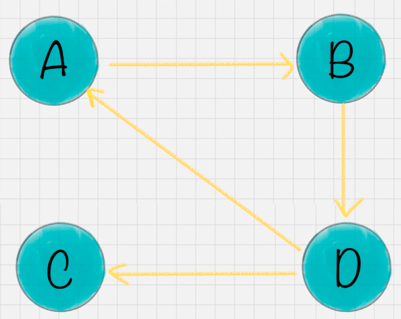
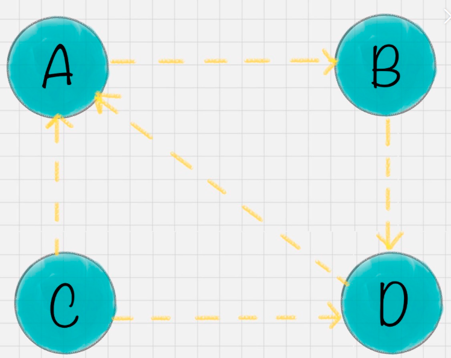
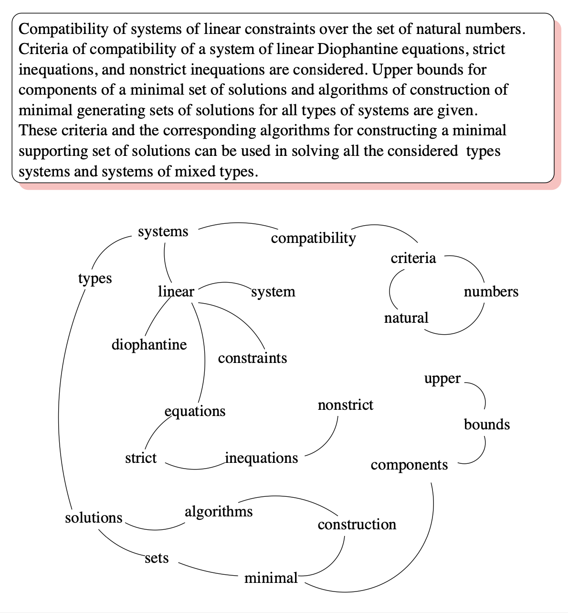
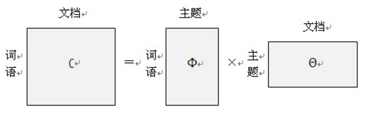

## TF-IDF 提取关键词

### 简介

TF-IDF(Term Frequency-Inverse Document Frequency, 词频-逆文件频率).TF-IDF是一种统计方法，用以评估一字词对于一个文件集或一份文件在一个语料库中的重要程度。字词的重要性随着它在文件中出现的次数成正比增加，但同时会随着它在语料库中出现的频率成反比下降。换句话说就是：**一个词语在一篇文章中出现次数越多, 同时在所有文档中出现次数越少, 越能够代表该文章。**

> TF-IDF 算法主要适用于英文，中文首先要分词，分词后要解决多词一义，以及一词多义问题，这两个问题通过简单的tf-idf方法不能很好的解决。于是就有了后来的词嵌入方法，用向量来表征一个词。

<!--more-->

### TF-IDF 

#### TF

表示词条（关键字）在文本中出现的次数（frequency）(一般不用)。TF 背后的隐含的假设是，查询关键字中的单词应该相对于其他单词更加重要，而文档的重要程度，也就是相关度，与单词在文档中出现的次数成正比。比如，“Car” 这个单词在文档 A 里出现了 5 次，而在文档 B 里出现了 20 次，那么 TF 计算就认为文档 B 可能更相关。

##### 变种一:通过对数函数避免 TF 线性增长

理由：虽然我们一般认为一个文档包含查询关键词多次相对来说表达了某种相关度，但这样的关系很难说是线性的。以 “Car Insurance” 为例，文档 A 可能包含 “Car” 这个词 100 次，而文档 B 可能包含 200 次，是不是说文档 B 的相关度就是文档 A 的 2 倍呢？其实，当这种频次超过了某个阈值之后，这个 TF 也就没那么有区分度了。

**用 Log，也就是对数函数，对 TF 进行变换，就是一个不让 TF 线性增长的技巧**。具体来说，人们常常用 1+Log(TF) 这个值来代替原来的 TF 取值。在这样新的计算下，假设 “Car” 出现一次，新的值是 1，出现 100 次，新的值是 $log 100=5.6$，而出现 200 次，新的值是$log 200 = 6.3$。很明显，这样的计算保持了一个平衡，既有区分度，但也不至于完全线性增长。

##### 变种二：标准化解决长文档、短文档问题

经典的计算并没有考虑 “长文档” 和“短文档”的区别。一个文档 A 有 3,000 个单词，一个文档 B 有 250 个单词，很明显，即便 “Car” 在这两个文档中都同样出现过 20 次，也不能说这两个文档都同等相关。**对 TF 进行 “标准化”（Normalization），特别是根据文档的最大 TF 值进行的标准化，成了另外一个比较常用的技巧**。
$$
tf_{ij} = \frac{n_{i,j}}{\sum_k n_{k,j}}
$$
其中$n_{i,j}$是词$w_i$在文档$d_j$中出现的次数，分母是文档$d_j$中所有词汇出现的次数总和。

#### IDF

仅有 TF 不能比较完整地描述文档的相关度。因为语言的因素，有一些单词可能会比较自然地在很多文档中反复出现，比如英语中的 “The”、“An”、“But” 等等。这些词大多起到了链接语句的作用，是保持语言连贯不可或缺的部分。然而，如果我们要搜索 “How to Build A Car” 这个关键词，其中的 “How”、“To” 以及 “A” 都极可能在绝大多数的文档中出现，这个时候 TF 就无法帮助我们区分文档的相关度了。

逆文档频率的思路很简单，就是我们需要去 “惩罚”（Penalize）那些出现在太多文档中的单词。

##### 变种三：对数函数处理 IDF

某一特定词语的IDF，可以由总文件数目除以包含该词语的文件的数目，再将得到的商取对数得到。如果包含词条t的文档越少, IDF越大，则说明词条具有很好的类别区分能力。
$$
idf_w = log{\frac{|D|}{|j:t_i \in d_j|}}
$$

其中，$|D|$表示语料库中文档总数，分母为包含词w的文档数+1，分母加1是为了避免出现分母为零的情况。

样做的好处就是，第一，使用了文档总数来做标准化，很类似上面提到的标准化的思路；第二，利用对数来达到非线性增长的目的。

##### 变种四：查询词及文档向量标准化

对查询关键字向量，以及文档向量进行标准化，使得这些向量能够不受向量里有效元素多少的影响，也就是不同的文档可能有不同的长度。在线性代数里，可以把向量都标准化为一个单位向量的长度。这个时候再进行点积运算，就相当于在原来的向量上进行余弦相似度的运算。所以，另外一个角度利用这个规则就是直接在多数时候进行余弦相似度运算，以代替点积运算。

#### TF-IDF

某一特定文件内的高词语频率，以及该词语在整个文件集合中的低文件频率，可以产生出高权重的TF-IDF。因此，TF-IDF倾向于过滤掉常见的词语，保留重要的词语(关键词)。
$$
TF-IDF = TF * IDF
$$

### TF-IDF 的应用

1. 搜索引擎
2. 关键词提取
3. 文本相似性
4. 文本摘要


### 代码

具体实现，移步[GitHub](https://github.com/jeffery0628/keyword_extraction)

```python
def tf_idf(document, corpus):  # 计算TF-IDF,并返回字典
    """

    :param document: 计算document里面每个词的tfidf值，document为文本分词后的形式，
    如:[6 月 19 日 2012 年度 中国 爱心 城市 公益活动 新闻 发布会 在京举行]
    如果是对一篇文档进行关键词提取，则需要对文档进行分句，把每句话看成一个document，corpus则存放的是整篇文档分词后的所有句子（句子为分词后的结果）。

    :param corpus:  corpus为所有问当分词后的列表：[document1,document2,document3,...]
    :return:dict类型，按照tfidf值从大到小排序： orderdict[word] = tfidf_value
    """
    word_tfidf = {}
    # 计算词频
    freq_words = Counter(document)
    for word in freq_words:
        # 计算TF：某个词在文章中出现的次数/文章总词数
        tf = freq_words[word] / len(document)

        # 计算IDF：log(语料库的文档总数/(包含该词的文档数+1))
        idf = math.log(len(corpus) / (wordinfilecount(word, corpus) + 1))

        # 计算每个词的TFIDF值
        tfidf = tf * idf  # 计算TF-IDF
        word_tfidf[word] = tfidf

    orderdic = sorted(word_tfidf.items(), key=lambda item: item[1], reverse=True)  # 给字典排序
    return orderdic
  
if __name__ == '__main__':
    stop_words_path = r'stop_words.txt'  # 停用词表路径
    stop_words = get_stopwords(stop_words_path)  # 获取停用词表列表

    documents_dir = 'data'
    filelist = get_documents(documents_dir)  # 获取文件列表

    corpus = get_corpus(filelist, stop_words)  # 建立语料库

    for idx,document in enumerate(corpus):
        word_tfidf = tf_idf(document, corpus)  # 计算TF-IDF
        # 输出前十关键词
        print('document {},top 10 key words{}'.format(idx+1,word_tfidf[:10]))
```

使用scikit-learn 计算tfidf

```python
from sklearn.feature_extraction.text import TfidfTransformer, TfidfVectorizer
# 对语料进行稍微处理
corpus = [*map(lambda x:" ".join(x), corpus)]
tfidf_model = TfidfVectorizer()
tfidf_matrix = tfidf_model.fit_transform(corpus)  # 计算每个词的tfidf值
words = tfidf_model.get_feature_names()# 所有词的集合
for i in range(len(corpus)):
  	word_tfidf = {}
  	for j in range(len(words)):
        word_tfidf[words[j]] = tfidf_matrix[i, j]
        word_tfidf = sorted(word_tfidf.items(),key=lambda item:item[1],reverse=True)
        print('document {},top 10 key words{}'.format(i+1, word_tfidf[:10]))
```

## TextRank 提取关键词

### 简介

TF-IDF 算法对有多段文本的关键词提取非常有效，但是对于单篇或者文档分割较少的文本表现得不是特别好。如果需要提取关键词的语句只有一句话，那么基于TF-IDF可以知道，所有关键词的重要度都为0(因为IDF值为0)，这种情况下使用TextRank是比较好的选择。

TextRank是一种基于图排序的算法，基本思想是(来源于PageRank)：通过把文本分割成若干组成单元(单词、句子)并建立图模型，利用投票机制对文本中的重要成分进行排序，**仅利用单篇文档本身的信息就可以实现关键词提取、文本摘要**。和 LDA、HMM 等模型不同, TextRank不需要事先对多篇文档进行学习训练, 因其简洁有效而得到广泛应用。

### PageRank

#### PageRank 的简化模型

假设一共有 4 个网页 A、B、C、D。它们之间的链接信息如图所示：


出链指的是链接出去的链接。入链指的是链接进来的链接。比如图中 A 有 2 个入链，3 个出链。简单来说，一个网页的影响力 = 所有入链集合的页面的加权影响力之和，用公式表示为：

$$
P R(u)=\sum_{v \in B_{u}} \frac{P R(v)}{L(v)}
$$
u 为待评估的页面， $B_{u}$ 为页面 $u$ 的入链集合。针对入链集合中的任意页面 $v$，它能给 $u$ 带来的影响力是其自身的影响力 $PR(v)$ 除以 $v$ 页面的出链数量，即页面 $v$ 把影响力 $PR(v)$ 平均分配给了它的出链，这样统计所有能给 $u$ 带来链接的页面 $v$，得到的总和就是网页 $u$ 的影响力，即为 $PR(u)$。所以出链会给被链接的页面赋予影响力，当我们统计了一个网页链出去的数量，也就是统计了这个网页的跳转概率。

在例子中，A 有三个出链分别链接到了 B、C、D 上。那么当用户访问 A 的时候，就有跳转到 B、C 或者 D 的可能性，跳转概率均为 1/3。B 有两个出链，链接到了 A 和 D 上，跳转概率为 1/2。这样，我们可以得到 A、B、C、D 这四个网页的转移矩阵 M：

$$
M=\left[\begin{array}{cccc}
0 & 1 / 2 & 1 & 0 \\
1 / 3 & 0 & 0 & 1 / 2 \\
1 / 3 & 0 & 0 & 1 / 2 \\
1 / 3 & 1 / 2 & 0 & 0
\end{array}\right]
$$
假设 A、B、C、D 四个页面的初始影响力都是相同的，即：
$$
w_{0}=\left[\begin{array}{l}
1 / 4 \\
1 / 4 \\
1 / 4 \\
1 / 4
\end{array}\right]
$$
当进行第一次转移之后，各页面的影响力 $w_{1}$ 变为：
$$
w_1=Mw_0=\left[\begin{array}{cccc}
0 & 1 / 2 & 1 & 0 \\
1 / 3 & 0 & 0 & 1 / 2 \\
1 / 3 & 0 & 0 & 1 / 2 \\
1 / 3 & 1 / 2 & 0 & 0
\end{array}\right]\left[\begin{array}{c}
1 / 4 \\
1 / 4 \\
1 / 4 \\
1 / 4
\end{array}\right]=\left[\begin{array}{c}
9 / 24 \\
5 / 24 \\
5 / 24 \\
5 / 24
\end{array}\right]
$$
然后再用转移矩阵乘以 $w_{1}$ 得到 $w_{2}$ 结果，直到第 $n$ 次迭代后 $w_{n}$ 影响力不再发生变化，可以收敛到 $(0.3333,0.2222,0.2222,0.2222$，也就是对应着 A、B、C、D 四个页面最终平衡状态下的影响力。能看出 A 页面相比于其他页面来说权重更大，也就是 PR 值更高。而 B、C、D 页面的 PR 值相等。

#### 等级泄露（Rank Leak）

如果一个网页没有出链，就像是一个黑洞一样，吸收了其他网页的影响力而不释放，最终会导致其他网页的 PR 值为 0。



#### 等级沉没（Rank Sink）

如果一个网页只有出链，没有入链，计算的过程迭代下来，会导致**这个网页**的 PR 值为 0（也就是不存在公式中的 V）。



#### 解决方案：随机浏览

为了解决简化模型中存在的等级泄露和等级沉没的问题，拉里·佩奇提出了 PageRank 的随机浏览模型。他假设了这样一个场景：用户并不都是按照跳转链接的方式来上网，还有一种可能是不论当前处于哪个页面，都有概率访问到其他任意的页面，比如说用户就是要直接输入网址访问其他页面，虽然这个概率比较小。

所以他定义了阻尼因子 d，这个因子代表了用户按照跳转链接来上网的概率，通常可以取一个固定值 0.85，而 1-d=0.15 则代表了用户不是通过跳转链接的方式来访问网页的，比如直接输入网址。
$$
P R(u)=\frac{1-d}{N}+d \sum_{v \in B_{u}} \frac{P R(v)}{L(v)}
$$


其中 $N$ 为网页总数，这样我们又可以重新迭代网页的权重计算了，加入了阻尼因子 $d$，一定程度上解决了等级泄露和等级沉没的问题。通过数学定理也可以证明，最终 PageRank 随机浏览模型是可以收敛的，也就是可以得到一个稳定正常的 PR 值。

### TextRank

TextRank通过词之间的相邻关系构建网络，然后用PageRank迭代计算每个节点的rank值，排序rank值即可得到关键词。PageRank迭代计算公式如下：

$$
P R\left(V_{i}\right)=(1-d)+d * \sum_{j \in \operatorname{In}\left(V_{i}\right)} \frac{1}{\left|O u t\left(V_{j}\right)\right|} P R\left(V_{j}\right)
$$
其中，d:表示阻尼系数，一般为0.85。$V_i$：表示图中任一节点。$In(V_i)$:表示指向顶点$V_i$的所有顶点的集合。$|Out(V_j)|$：表示由顶点$V_j$连接出去的所有顶点集合个数。$PR(V_i)$：表示顶点$V_i$的最终排序权重。(与pagerank公式基本一致。)

网页之间的链接关系可以用图表示，那么怎么把一个句子（可以看作词的序列）构建成图呢？TextRank将某一个词与其前面的N个词、以及后面的N个词均具有图相邻关系（类似于N-gram语法模型）。具体实现：设置一个长度为N的滑动窗口，所有在这个窗口之内的词都视作词结点的相邻结点；则TextRank构建的词图为无向图。下图给出了由一个文档构建的词图（去掉了停用词并按词性做了筛选）：



考虑到不同词对可能有不同的共现（co-occurrence），TextRank将共现作为无向图边的权值。那么，TextRank的迭代计算公式如下：
$$
W S\left(V_{i}\right)=(1-d)+d * \sum_{j \in \operatorname{In}\left(V_{i}\right)} \frac{w_{ij}}{\left|O u t\left(V_{j}\right)\right|} W S\left(V_{j}\right)
$$
该公式仅仅比PageRank多了一个权重项$w_{ij}$，用来表示两个节点之间的边连接有不同的重要程度。

#### TextRank 关键词(短语)提取算法

1. 把给定的文本$T$按照完整句子进行分割，即$T = [S_1,S_2,\ldots,S_n]$.
2. 文本$T$中每个句子$S_i$，进行分词和词性标注处理，并过滤掉停用词，只保留指定词性的单词，如名词、动词、形容词，即$S_i = [t_{i,1},t_{i,2},\ldots,t_{i,\pi}]$,其中$t_{ij}$是保留后的候选关键词。
3. 构建候选关键词图$G = (V,E)$，其中$V$为节点集，由步骤2生成的候选关键词组成，然后采用共现关系（co-occurrence）构造任两点之间的边，两个节点之间存在边仅当它们对应的词汇在长度为K的窗口中共现，K表示窗口大小，即最多共现K个单词。
4. 根据上面公式，迭代传播各节点的权重，直至收敛。
5. 对节点权重进行倒序排序，从而得到最重要的T个单词，作为候选关键词。
6. 由步骤5得到最重要的T个单词，在原始文本中进行标记，若形成相邻词组，则组合成多词关键词。

#### 代码


```python
from collections import defaultdict
import jieba.posseg as pseg
import sys

class textrank_graph:
    def __init__(self):
        self.graph = defaultdict(list) # key:[(),(),(),...] 如：是 [('是', '全国', 1), ('是', '调查', 1), ('是', '失业率', 1), ('是', '城镇', 1)]
        self.d = 0.85  # d是阻尼系数，一般设置为0.85
        self.min_diff = 1e-5  # 设定收敛阈值

    # 添加节点之间的边
    def addEdge(self, start, end, weight):
        self.graph[start].append((start, end, weight))
        self.graph[end].append((end, start, weight))

    # 节点排序
    def rank(self):
        # 一共有14个节点
        print(len(self.graph))
        # 默认初始化权重
        weight_deault = 1.0 / (len(self.graph) or 1.0)
        # nodeweight_dict, 存储节点的权重
        nodeweight_dict = defaultdict(float)
        # outsum，存储节点的出度权重
        outsum_node_dict = defaultdict(float)
        # 根据图中的边，更新节点权重
        for node, out_edge in self.graph.items():
            # 是 [('是', '全国', 1), ('是', '调查', 1), ('是', '失业率', 1), ('是', '城镇', 1)]
            nodeweight_dict[node] = weight_deault # 初始化节点权重
            outsum_node_dict[node] = sum((edge[2] for edge in out_edge), 0.0) # 统计node节点的出度
        # 初始状态下的textrank重要性权重
        sorted_keys = sorted(self.graph.keys())
        # 设定迭代次数，
        step_dict = [0]
        for step in range(1, 1000):
            for node in sorted_keys:
                s = 0
                # 计算公式：(edge_weight/outsum_node_dict[edge_node])*node_weight[edge_node]
                for e in self.graph[node]:
                    s += e[2] / outsum_node_dict[e[1]] * nodeweight_dict[e[1]]
                # 计算公式：(1-d) + d*s
                nodeweight_dict[node] = (1 - self.d) + self.d * s
            step_dict.append(sum(nodeweight_dict.values()))

            if abs(step_dict[step] - step_dict[step - 1]) <= self.min_diff:
                break

        # 利用Z-score进行权重归一化，也称为离差标准化，是对原始数据的线性变换，使结果值映射到[0 - 1]之间。
        # 先设定最大值与最小值均为系统存储的最大值和最小值
        (min_rank, max_rank) = (sys.float_info[0], sys.float_info[3])
        for w in nodeweight_dict.values():
            if w < min_rank:
                min_rank = w
            if w > max_rank:
                max_rank = w

        for n, w in nodeweight_dict.items(): # 归一化
            nodeweight_dict[n] = (w - min_rank / 10.0) / (max_rank - min_rank / 10.0)

        return nodeweight_dict


class TextRank:
    def __init__(self):
        self.candi_pos = ['n', 'v', 'a'] # 关键词的词性：名词，动词，形容词
        self.span = 5 # 窗口大小

    def extract_keywords(self, text, num_keywords):
        g = textrank_graph()
        cm = defaultdict(int)
        word_list = [[word.word, word.flag] for word in pseg.cut(text)] # 使用jieba分词并且对词性进行标注
        for i, word in enumerate(word_list): # 该循环用于统计在窗口范围内，词的共现次数
            if word[1][0] in self.candi_pos and len(word[0]) > 1: #
                for j in range(i + 1, i + self.span):
                    if j >= len(word_list):# 防止下标越界
                        break
                    if word_list[j][1][0] not in self.candi_pos or len(word_list[j][0]) < 2: # 排除词性不在关键词词性列表中的词或者词长度小于2的词
                        continue
                    pair = tuple((word[0], word_list[j][0]))
                    cm[(pair)] += 1

        for terms, w in cm.items():
            g.addEdge(terms[0], terms[1], w)
        nodes_rank = g.rank()
        nodes_rank = sorted(nodes_rank.items(), key=lambda asd:asd[1], reverse=True)

        return nodes_rank[:num_keywords]

```

### LDA (Latent Dirichlet Allocation) 提取关键词(???)

TF-IDF 和 TextRank 两种算法更多反映的是文本的统计信息，对于文本之间的语义关系考虑得比较少。LDA是一种能够体文本语义关系的关键词提取方法。

> 二项分布（Binomial Distribution），即重复n次的伯努利试验（Bernoulli Experiment），用$\xi$表示随机试验的结果。如果事件发生的概率是P,则不发生的概率$q=1-p$，$N$次独立重复试验中发生K次的概率是$P(\xi=K)= C(n,k) * p^k * (1-p)^{n-k}$，其中$C(n, k) =\frac{n!}{(k!(n-k)!)}$. 期望：$E(ξ)=np$,方差：$D(ξ)=npq$其中$q=1-p$
>
> 多项分布（Multinomial Distribution）：多项式分布是二项式分布的推广。二项分布的典型例子是扔硬币，硬币正面朝上概率为p, 重复扔n次硬币，k次为正面的概率即为一个二项分布概率。把二项分布公式推广至多种状态，就得到了多项分布。 
> 某随机实验如果有k个可能结局$A_1,A_2,\ldots,A_k$，分别将他们的出现次数记为随机变量$X_1,X_2,\ldots,X_k$，它们的概率分布分别是$p_1,p_2,\ldots,p_k$那么在$n$次采样的总结果中，$A_1$出现$n_1$次、$A_2$出现$n_2$次,$\dots$,$A_k$出现$n_k$次的这种事件的出现概率$P$有下面公式：
> $$
> P\left(X_{1}=n_{1}, \cdots, X_{k}=n_{k}\right)=\left\{\begin{array}{ll}
> \frac{n !}{n_{1} ! \cdots n_{k} !} p_{1}^{n_{1}} \cdots p_{k}^{n_{k}} & , \sum_{i=1}^{k} n_{i}=n \\
> 0 & , \text { otherwise }
> \end{array}\right.
> $$
> Beta分布与Dirichlet分布的定义域均为[0,1]，在实际使用中，通常将两者作为概率的分布，Beta分布描述的是单变量分布，Dirichlet分布描述的是多变量分布，因此，Beta分布可作为二项分布的先验概率，Dirichlet分布可作为多项分布的先验概率。

在主题模型中，主题表示一个概念，表现为一系列相关的单词，是这些单词的条件概率。形象来说，主题就是一个桶，里面装了出现概率较高的单词，这些单词与这个主题有很强的相关性。

怎样才能生成主题？对文章的主题应该怎么分析？这是主题模型要解决的问题。

 首先，可以用生成模型来看文档和主题这两件事。所谓生成模型，就是说，我们认为**一篇文章的每个词都是通过“以一定概率选择了某个主题，并从这个主题中以一定概率选择某个词语”**这样一个过程得到的。那么，如果我们要生成一篇文档，它里面的每个词语出现的概率为：
$$
p(W|D) = \sum_T P(W|T)P(T|D)
$$
其中，$W$表示词，$T$表示主题，$D$表示文档。



其中”文档-词语”矩阵表示每个单词在每个文档中的词频，即出现的概率；”主题-词语”矩阵表示每个主题中每个单词的出现概率；”文档-主题”矩阵表示每个主题在每个文档中出现的概率。

单词对于主题的概率和主题对于文档的概率，可以通过Gibbs采样法（？？？）来进行概率的计算。

主题$T_k$下各个词$W_i$的权重计算公式：
$$
P(W_i|T_k) = \frac{C_{ik}+\beta}{\sum_{i=1}^N{C_{ik}+N*\beta}} = \phi_i^{t=k} 
$$
其中，$w_i$：表示单词集合中的任一单词。$T_k$:表示主题集合中任一主题。$P(w_i|T_k)$:表示在主题为$k$时，单词$i$出现的概率，其简记为$\phi_i^{t=k}$，$C_{ik}$:表示语料库中单词$i$被赋予主题$k$的次数。$N$:表示词汇表的大小。$\beta$：表示超参数。

文档$D_m$下各个词$T_k$的权重计算公式：
$$
P(T_k|D_m) = \frac{C_{km}+\alpha}{\sum^K_{k=1}C_{km}+K*\alpha}=\theta^m_{t=k}
$$
其中，$D_m$:表示文档集合中任一文档。$T_k$:表示主题集合中任一主题。$P(T_k|D_m)$:表示语料库中文档m中单词被赋予主题$k$的次数。$K$：表示主题的数量。$\alpha$表示超参数。

得到了指定文档下某主题出现的概率，以及指定主题下、某单词出现的概率。那么由联合概率分布可以知道，对于指定文档某单词出现的概率：
$$
P(W_i|D_m) = \sum_{k=1}^K{\phi_i^{t=k}*\theta_{t=k}^m}
$$
基于上述公式，可以计算出单词$i$对于文档$m$的主题重要性。

但是由于在LDA主题概率模型中，所有的词汇都会以一定的概率出现在每个主题，所以这样会导致最终计算的单词对于文档的主题重要性区分度受影响。为了避免这种情况，一般会将单词相对于主题概率小于一定阈值的概率置为0.

```python
# 主题模型
class TopicModel(object):
    # 三个传入参数：处理后的数据集，关键词数量，具体模型（LSI、LDA），主题数量
    def __init__(self, doc_list, keyword_num, model='LDA', num_topics=4):
        # 使用gensim的接口，将文本转为向量化表示
        # 先构建词空间
        self.dictionary = corpora.Dictionary(doc_list)
        # 使用BOW模型向量化 (token_id,freq)
        corpus = [self.dictionary.doc2bow(doc) for doc in doc_list]  # (token_id,freq)
        # 对每个词，根据tf-idf进行加权，得到加权后的向量表示
        self.tfidf_model = models.TfidfModel(corpus)
        self.tfidf_corpus = self.tfidf_model[corpus]

        self.keyword_num = keyword_num
        self.num_topics = num_topics
        # 选择加载胡模型
        if model == 'LSI':
            self.model = self.train_lsi()
        else:
            self.model = self.train_lda()
        # 得到数据集的主题-词分布
        word_dic = self.word_dictionary(doc_list)
        self.wordtopic_dic = self.get_wordtopic(word_dic)

    # 向量化
    def doc2bowvec(self, word_list):
        vec_list = [1 if word in word_list else 0 for word in self.dictionary]
        print("vec_list", vec_list)
        return vec_list

    # 词空间构建方法和向量化方法，在没有gensim接口时的一般处理方法
    def word_dictionary(self, doc_list):
        dictionary = []
        # 2及变1及结构
        for doc in doc_list:
            # extend he append 方法有何异同 容易出错
            dictionary.extend(doc)

        dictionary = list(set(dictionary))

        return dictionary

    # 得到数据集的主题 - 词分布
    def get_wordtopic(self, word_dic):
        wordtopic_dic = {}
        for word in word_dic:
            singlist = [word]
            # 计算每个词胡加权向量
            word_corpus = self.tfidf_model[self.dictionary.doc2bow(singlist)]
            # 计算每个词de主题向量
            word_topic = self.model[word_corpus]
            wordtopic_dic[word] = word_topic

        return wordtopic_dic

    def train_lsi(self):
        lsi = models.LsiModel(self.tfidf_corpus, id2word=self.dictionary, num_topics=self.num_topics)
        return lsi

    def train_lda(self):
        lda = models.LdaModel(self.tfidf_corpus, id2word=self.dictionary, num_topics=self.num_topics)
        return lda

    # 计算词的分布和文档的分布的相似度，取相似度最高的keyword_num个词作为关键词
    def get_simword(self, word_list):
        # 文档的加权向量
        sentcorpus = self.tfidf_model[self.dictionary.doc2bow(word_list)]
        # 文档主题 向量
        senttopic = self.model[sentcorpus]

        # senttopic [(0, 0.03457821), (1, 0.034260772), (2, 0.8970413), (3, 0.034119748)]
        # 余弦相似度计算

        def calsim(l1, l2):
            a, b, c = 0.0, 0.0, 0.0
            for t1, t2 in zip(l1, l2):
                x1 = t1[1]
                x2 = t2[1]
                a += x1 * x1
                b += x1 * x1
                c += x2 * x2
            sim = a / math.sqrt(b * c) if not (b * c) == 0.0 else 0.0
            return sim

        # 计算输入文本和每个词的主题分布相似度
        sim_dic = {}
        for k, v in self.wordtopic_dic.items():
            # 还是计算每个再本文档中的词  和文档的相识度
            if k not in word_list:
                continue
            #
            sim = calsim(v, senttopic)
            sim_dic[k] = sim

        for k, v in sorted(sim_dic.items(), key=lambda item:item[1], reverse=True)[:self.keyword_num]:
            print(k, v)
        print()


#
def topic_extract(word_list, model, pos=False, keyword_num=10):
    doc_list = load_data(pos)
    topic_model = TopicModel(doc_list, keyword_num, model=model)
    topic_model.get_simword(word_list)


def textrank_extract(text, pos=False, keyword_num=10):
    textrank = analyse.textrank
    keywords = textrank(text, keyword_num)
    # 输出抽取出的关键词
    for keyword in keywords:
        print(keyword + "/ ", end='')
    print()


# test
if __name__ == '__main__':
    text = '6月19日,《2012年度“中国爱心城市”公益活动新闻发布会》在京举行。' + \
           '中华社会救助基金会理事长许嘉璐到会讲话。基金会高级顾问朱发忠,全国老龄' + \
           '办副主任朱勇,民政部社会救助司助理巡视员周萍,中华社会救助基金会副理事长耿志远,' + \
           '重庆市民政局巡视员谭明政。晋江市人大常委会主任陈健倩,以及10余个省、市、自治区民政局' + \
           '领导及四十多家媒体参加了发布会。中华社会救助基金会秘书长时正新介绍本年度“中国爱心城' + \
           '市”公益活动将以“爱心城市宣传、孤老关爱救助项目及第二届中国爱心城市大会”为主要内容,重庆市' + \
           '、呼和浩特市、长沙市、太原市、蚌埠市、南昌市、汕头市、沧州市、晋江市及遵化市将会积极参加' + \
           '这一公益活动。中国雅虎副总编张银生和凤凰网城市频道总监赵耀分别以各自媒体优势介绍了活动' + \
           '的宣传方案。会上,中华社会救助基金会与“第二届中国爱心城市大会”承办方晋江市签约,许嘉璐理' + \
           '事长接受晋江市参与“百万孤老关爱行动”向国家重点扶贫地区捐赠的价值400万元的款物。晋江市人大' + \
           '常委会主任陈健倩介绍了大会的筹备情况。'

    pos = False
    seg_list = seg_to_list(text, pos)
    filter_list = word_filter(seg_list, pos)

    print('LDA模型结果：')
    topic_extract(filter_list, 'LDA', pos)
```


LDA 步骤总结
数据集处理

1. 先构建词空间  Dictionary(4064 unique tokens: ['上将', '专门', '乘客', '仪式', '体验']...)
2. 使用BOW模型向量化   corpus [[(0, 1), (1, 1), (2, 2), (3, 1),。。
3. 对每个词，根据tf-idf进行加权，得到加权后的向量表示

根据数据集获得模型

4. 得到数据集的主题-词分布  model (得到每个词的向量）（文档转列表 再转集合去重，再转列表）{'白血病': [(0, 0.1273009), (1, 0.6181468), (2, 0.12732704), (3, 0.12722531)], '婴儿': [。。。
5. 求文档的分布:词》向量》tf/idf加权》同第4步得到文档的分布向量 [(0, 0.033984687), (1, 0.033736005), (2, 0.8978361), (3, 0.03444325)]
6. 计算余弦距离得到结果